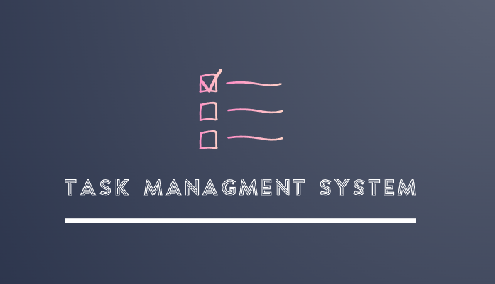
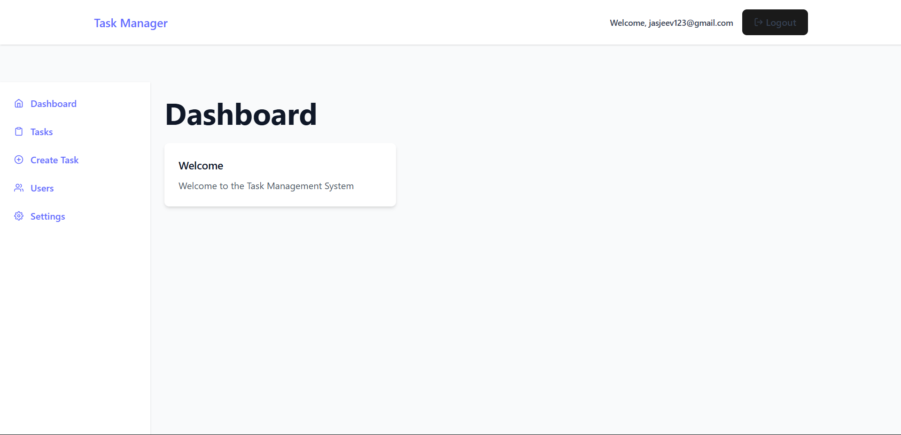
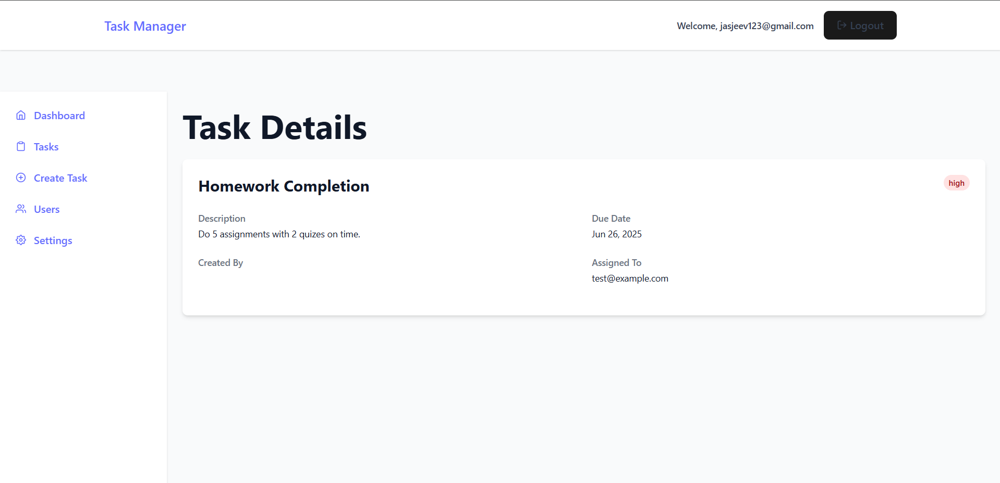
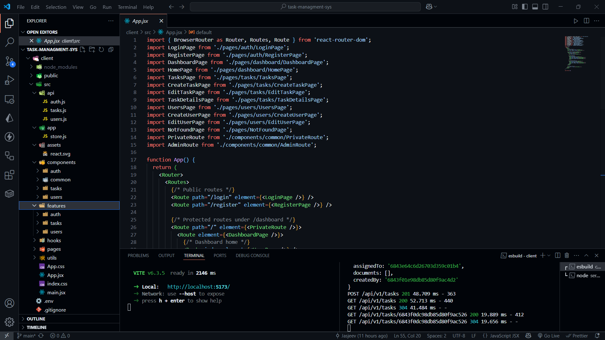
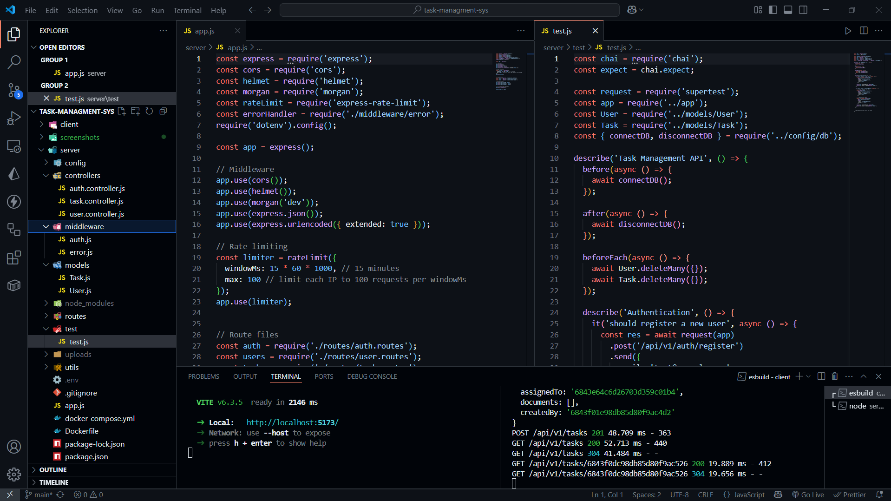
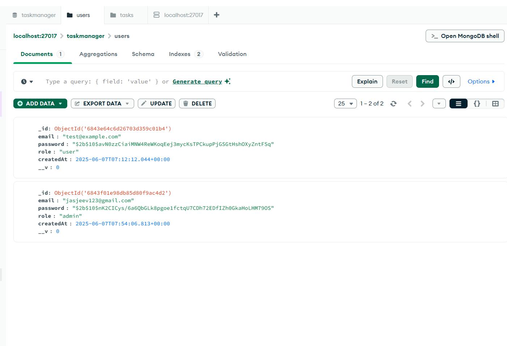
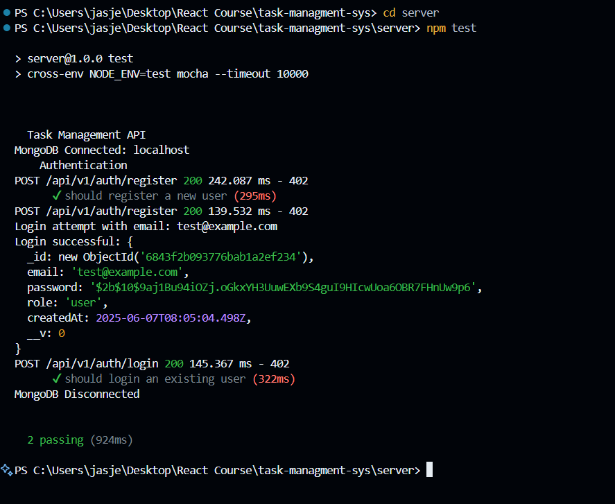

# Task Management System 🚀

 

A full-stack task management application with user authentication, task CRUD operations, file attachments, and role-based access control.

## Features ✨

- **User Authentication**: JWT-based login/registration
- **Task Management**: Create, assign, and track tasks
- **File Attachments**: Upload up to 3 PDF documents per task
- **Role-Based Access**: Admin/user permission system
- **Responsive UI**: Built with React + TailwindCSS
- **Real-time Updates**: WebSocket integration
- **Docker Support**: Easy containerized deployment


---
## Tech Stack 💻

### Frontend


### Backend


### DevOps


### 🔐 Test Login Credentials

For testing purposes, you can use the following credentials to log in as an **admin** or a **regular user**:

#### Admin Account

```json
{
  "email": "admin@example.com",
  "password": "AdminPass123!",
  "role": "admin"
}
```

#### User Account

```json
{
  "email": "user@example.com",
  "password": "UserPass456!",
  "role": "user"
}
```

> These accounts are intended for development/testing only. Make sure to remove or secure them before deploying to production.


## Screenshots 📸

| Login Page | Dashboard | Task View |
|------------|-----------|-----------|
|  |  |  |

| Frontend | Backend | Database |
|------------|-----------|-----------|
|  |  |  |

### Backend Tests Data


## Directory Structure 📂

```bash
TASK-MANAGEMENT-SYS/
├── client/              # React frontend (Vite + TailwindCSS)
│   ├── src/             # Frontend source code
│   │   ├── api/         # API service modules
│   │   ├── components/  # Reusable UI components
│   │   ├── features/    # Redux state slices
│   │   ├── pages/       # Route-based components
│   │   └── ...          # Other frontend assets
│   └── vite.config.js   # Vite configuration
│
├── server/              # Node.js backend (Express + MongoDB)
│   ├── config/          # Database and JWT config
│   ├── controllers/     # Route controllers
│   ├── middleware/      # Auth and error handlers
│   ├── models/          # MongoDB schemas
│   ├── routes/          # API endpoints
│   ├── uploads/         # File storage directory
│   ├── server.js        # Backend entry point
│   └── docker-compose.yml   # Docker container orchestration

```

## Installation 🛠️

### Prerequisites
- Node.js v20+
- MongoDB
- Docker (optional)

### Local Setup

1. **Clone the repository**
   ```bash
   git clone https://github.com/yourusername/task-management-system.git
   cd task-management-system
   ```

2. **Backend Setup**
   ```bash
   cd server
   npm install
   cp .env.example .env
   # Edit .env with your credentials
   npm run dev
   ```

3. **Frontend Setup**
   ```bash
   cd ../client
   npm install
   cp .env.example .env
   # Edit .env with your API URL (VITE_API_URL=http://localhost:5000)
   npm run dev
   ```

### Docker Setup
```bash
docker-compose up --build
```

## Environment Variables 🔐

### Frontend (`client/.env`)
```env
VITE_API_URL=http://localhost:5000
```

### Backend (`server/.env`)
```env
MONGO_URI=mongodb://localhost:27017/taskmanager
JWT_SECRET=your_jwt_secret_key
JWT_EXPIRE=30d
PORT=5000
FILE_UPLOAD_PATH=./uploads
MAX_FILE_UPLOAD=3
FILE_UPLOAD_SIZE=1000000
```

## API Documentation 📚

[](https://documenter.getpostman.com/view/your-doc-id) <!-- Add your Postman link -->

Key Endpoints:
- `POST /api/v1/auth/register` - User registration
- `POST /api/v1/auth/login` - User login
- `GET /api/v1/tasks` - List all tasks
- `POST /api/v1/tasks` - Create new task
- `PUT /api/v1/tasks/:id` - Update task

## Testing 🧪

```bash
# Backend tests
cd server
npm test

# Frontend tests (coming soon)
```

## Deployment 🚀

[](https://render.com/deploy)

Alternative deployment options:
- Heroku
- AWS EC2
- DigitalOcean
- Vercel

## Contributing 🤝

1. Fork the project
2. Create your feature branch (`git checkout -b feature/AmazingFeature`)
3. Commit your changes (`git commit -m 'Add some AmazingFeature'`)
4. Push to the branch (`git push origin feature/AmazingFeature`)
5. Open a Pull Request

## License 📄

MIT © [Jasjeev Singh Kohli](https://github.com/jasjeev013)

---

<div align="center">
  Made with ❤️ and JavaScript
</div>

